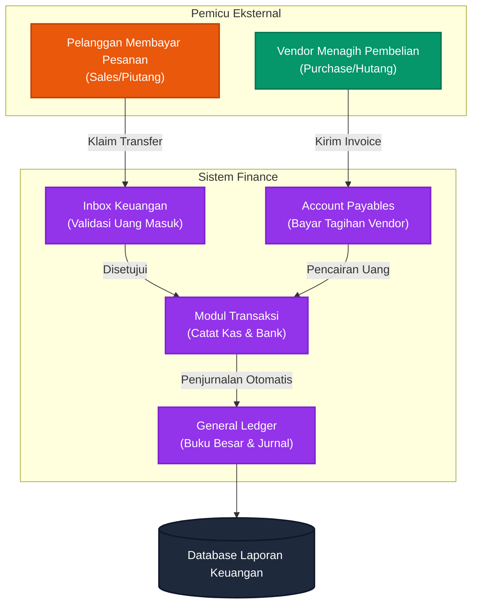

# 💰 Arus Kas & Keuangan (Finance Flow)

Dokumen ini merangkum seluruh pergerakan uang yang ada di dalam sistem. Ini adalah "Jantung" perusahaan di mana modul Penjualan (Sales) dan modul Pembelian (Purchase) pada akhirnya akan bermuara.

## Diagram Arus Uang

---

## Penjelasan Fase

### Uang Masuk (Account Receivables / Piutang)
1. Setiap kali pelanggan mengklaim telah membayar pesanan dari Tim Sales, notifikasi tersebut akan masuk ke menu **Finance Inbox** di sistem Anda.
2. Tim Keuangan (*Finance*) wajib membuka *Internet Banking* untuk memvalidasi apakah uangnya benar-benar sudah masuk.
3. Jika divalidasi (ACC) dari *Inbox*, uang tersebut akan otomatis dicatat sebagai Kas Masuk di menu **Transaksi**, dan pesanan Sales otomatis berubah menjadi Lunas.

### Uang Keluar (Account Payables / Hutang)
4. Ketika Tim *Purchasing* berbelanja dari Vendor, vendor akan mengirimkan tagihan. 
5. Tagihan ini muncul di menu **Payables (Hutang)**. Tim Finance bertugas mencocokkan tagihan ini dengan Bukti Penerimaan Barang dari Gudang (lihat *Alur Penerimaan Barang*).
6. Jika *clear*, Finance melakukan transfer uang, mencatat pelunasannya di *Payables*, yang otomatis memotong Kas/Bank perusahaan di menu **Transaksi**.

### Akuntansi Inti (Core Accounting)
7. Setiap pergerakan uang yang terjadi di menu *Transaksi* (baik itu uang masuk, uang keluar, maupun transfer antar bank internal) akan langsung dijurnal dan diteruskan ke **General Ledger (Buku Besar)** oleh sistem.
8. Hal ini memastikan bahwa pemilik perusahaan / Manajemen dapat melihat neraca keuangan, profit/loss, dan laporan arus kas (*Cash Flow*) secara seketika (*real-time*).
