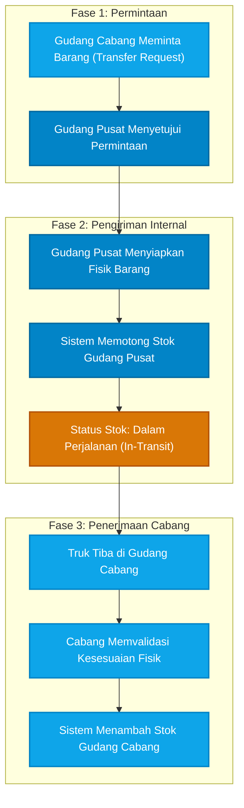

# 🚛 Alur Mutasi Antar Gudang (Stock Transfer)

Dokumen ini menjelaskan Standar Operasional Prosedur (SOP) ketika perusahaan perlu memindahkan fisik barang dari satu lokasi (misalnya **Gudang Pusat**) ke lokasi lain (misalnya **Gudang Cabang** atau **Toko Ritel**).

Mekanisme ini sangat vital untuk mencegah stok ganda (*double-counting*) selama barang sedang berada di atas truk pengiriman.

## Diagram Alur Mutasi

---

## Penjelasan Fase

### Fase 1: Permintaan
1. **Transfer Request**: Staf Gudang Cabang menyadari bahwa stok mereka menipis. Mereka menginput dokumen *Permintaan Mutasi* di sistem yang langsung masuk ke layar dasbor Kepala Gudang Pusat.
2. **Persetujuan**: Kepala Gudang Pusat mengecek ketersediaan barang. Jika ada, ia menyetujui permintaan tersebut untuk diproses.

### Fase 2: Pengiriman (Dispatch)
3. **Persiapan & Pemotongan Stok**: Staf Gudang Pusat menarik barang dari rak dan menaikkannya ke truk. Setelah divalidasi, sistem akan **mengurangi/memotong stok di Gudang Pusat**.
4. **Status In-Transit**: Walaupun stok terpotong, aset tersebut tidak hilang dari laporan keuangan perusahaan. Sistem secara cerdas mengalihkan barang tersebut ke lokasi virtual bernama **"In-Transit"** agar nilai aset perusahaan tetap seimbang.

### Fase 3: Penerimaan (Receiving)
5. **Validasi Kedatangan**: Saat truk tiba di Gudang Cabang, Kepala Gudang Cabang WAJIB memvalidasi kedatangan barang di sistem. Jika tidak divalidasi, barang akan selamanya menggantung berstatus *In-Transit*.
6. **Penambahan Stok**: Setelah divalidasi (QC fisik cocok), status *In-Transit* dihilangkan dan sistem secara resmi **menambahkan angka stok di Gudang Cabang**. Barang kini siap untuk dijual oleh cabang tersebut.
