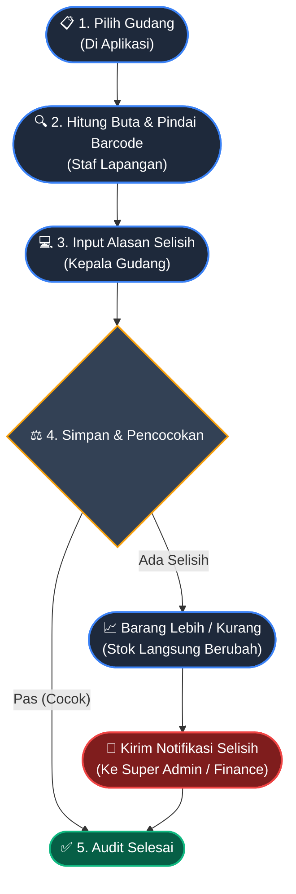

# 📦 Alur Stock Opname (Audit Gudang)

Dokumen ini menjelaskan prosedur audit inventaris fisik (*Stock Opname*) untuk memastikan bahwa angka yang ada di dalam sistem selalu cocok dengan barang fisik yang ada di rak gudang. Proses ini dirancang agar audit dapat dilakukan secara berkala (*cycle count*) tanpa harus menutup seluruh gudang berhari-hari.

## Diagram Alur Opname

---

## Penjelasan Fase

### Fase 1: Persiapan & Eksekusi Lapangan
1. **Pilih Gudang**: Kepala Gudang memilih gudang yang akan di-opname melalui layar aplikasi. Sistem akan memuat (*load*) seluruh data stok yang tercatat secara seketika (*real-time*).
2. **Hitung & Pindai Barcode**: Staf dapat menggunakan *Barcode Scanner* atau Kamera HP untuk memindai barang satu per satu secara langsung (*live input*), atau menghitung buta lalu memasukkan angkanya ke dalam sistem.

### Fase 2: Input & Validasi Sistem
3. **Input Alasan Selisih**: Sistem akan secara cerdas membandingkan jumlah yang diinput dengan *database*. Jika ada angka yang tidak pas (kurang/lebih), sistem **mewajibkan** pengguna untuk memilih *Alasan* (contoh: Salah Hitung, Hilang, Rusak, Kelebihan Terima).
4. **Simpan & Pencocokan**: Saat tombol simpan diklik, sistem mengeksekusi penyesuaian.

### Fase 3: Penyesuaian Otomatis & Notifikasi
5. **Eksekusi Penyesuaian**: Berbeda dengan sistem manual yang butuh *approval* lama, sistem aplikasi ini akan **langsung memotong atau menambah stok** saat itu juga agar operasional gudang tidak mandek (*bottleneck*).
6. **Notifikasi Otomatis**: Jika terjadi selisih (terutama kehilangan barang), sistem akan diam-diam mengirimkan peringatan otomatis (*Push Notification*) ke akun **Super Admin atau Finance** untuk ditindaklanjuti secara finansial di belakang layar tanpa mengganggu staf lapangan. 
7. **Selesai**: Proses audit selesai dengan cepat dan riwayatnya (*History*) dicatat permanen dalam sistem.
