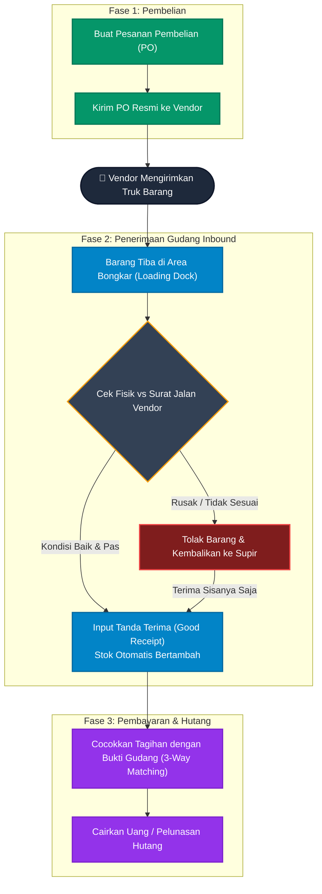

# 📥 Alur Penerimaan Barang (Inbound)

Dokumen ini menjelaskan Standar Operasional Prosedur (SOP) untuk siklus pengadaan hingga pembayaran (*Procure-to-Pay*), dengan fokus pada proses masuknya barang ke dalam gudang (*Inbound*). 

Proses penerimaan barang adalah gerbang utama pertahanan gudang. Kesalahan hitung pada tahap ini akan menyebabkan kerusakan data stok secara permanen ke depannya.

## Diagram Alur Penerimaan Barang

---

## Penjelasan Fase

### Fase 1: Pembelian (*Purchasing*)
1. **Purchase Order (PO)**: Tim Purchasing membuat dokumen pesanan pembelian ke *Supplier/Vendor*. Dokumen ini sangat penting karena akan menjadi acuan bagi Gudang bahwa dalam beberapa hari ke depan, akan ada truk yang datang. Tim Gudang tidak boleh menerima barang apa pun yang tidak memiliki nomor PO di sistem.

### Fase 2: Penerimaan Gudang (*Inbound*)
2. **Barang Tiba**: Truk vendor tiba di area bongkar muat (*Loading Dock*). Staf gudang (kuli angkut) menurunkan kardus-kardus tersebut.
3. **Pengecekan Fisik (QC)**: Kepala Gudang atau staf penerimaan mengecek kesesuaian antara fisik kardus dengan Surat Jalan dari supir truk, dan mencocokkannya dengan data PO di sistem aplikasi.
   * **Penolakan**: Jika ada kardus yang penyok, basah, atau jenis barangnya salah, gudang **berhak menolak** barang tersebut saat itu juga dan menitipkannya kembali ke supir truk untuk dibawa pulang.
   * **Penerimaan Sebagian**: Gudang tetap bisa menerima barang yang bagus saja.
4. **Input Penerimaan (*Good Receipt*)**: Setelah penghitungan selesai, Kepala Gudang memvalidasi penerimaan di aplikasi. Begitu tombol simpan ditekan, **stok di sistem akan langsung bertambah** dan barang siap untuk segera ditarik/dijual ke pelanggan.

### Fase 3: Pembayaran & Hutang (*Accounts Payable*)
5. **Validasi Tagihan (3-Way Matching)**: Vendor biasanya akan mengirimkan *Invoice* (Tagihan) ke kantor. Tim **Finance** wajib membandingkan 3 dokumen: (1) Tagihan Vendor, (2) PO asli dari Purchasing, dan (3) Tanda Terima Elektronik dari Gudang.
6. **Pelunasan**: Finance **hanya akan membayar** sebanyak jumlah barang yang benar-benar diterima dalam kondisi baik oleh Gudang (meskipun di tagihan vendor jumlahnya lebih banyak). Dengan begitu, perusahaan terhindar dari kerugian akibat salah tagih.
