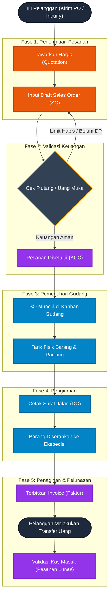

# 📈 Alur Penjualan (Sales Flow)

Dokumen ini menjelaskan Standar Operasional Prosedur (SOP) dari sisi siklus pendapatan (*Order-to-Cash*), mulai dari penerimaan pesanan pelanggan hingga uang masuk ke perusahaan.

## Diagram Alur Penjualan

---

## Penjelasan Fase

### 1. Penerimaan Pesanan (*Order Intake*)
Perjalanan dimulai ketika prospek/pelanggan melakukan inkuiri barang. Tim **Sales** dapat menerbitkan *Quotation* (Penawaran) terlebih dahulu jika diminta. Saat pelanggan setuju (biasanya dengan menerbitkan *Purchase Order* / PO Pelanggan), tim Sales wajib menginput data pesanan tersebut ke dalam sistem sebagai **Draft Sales Order (SO)**.

### 2. Validasi & Persetujuan (*Approval*)
Sebelum pesanan bisa dilayani oleh Gudang, pesanan wajib melewati pos penjagaan **Finance**. Jika pesanan bersifat *Tempo/Kredit*, Finance mengecek apakah *Limit Kredit* pelanggan tersebut masih tersedia dan apakah ia memiliki rekam jejak pembayaran yang menunggak. Jika pesanan bersifat *Tunai*, Finance mengecek apakah uang DP sudah masuk ke rekening bank. Jika ditolak, status SO dikembalikan ke tim Sales. Jika lolos, status SO di-ACC.

### 3. Pemenuhan Gudang (*Fulfillment*)
Hanya SO yang sudah berstatus ACC yang akan otomatis muncul di layar Kanban **Kepala Gudang**. Kepala Gudang kemudian menginstruksikan tim lapangan untuk menarik barang fisik dari rak (*picking*) dan membungkusnya (*packing*).

### 4. Pengiriman (*Delivery*)
Setelah kardus siap, sistem akan digunakan untuk mencetak **Surat Jalan (*Delivery Order / DO*)**. Barang beserta surat jalan ini diserahkan kepada kurir atau armada ekspedisi.

### 5. Penagihan & Pelunasan (*Invoicing & Cash Collection*)
Berdasarkan Surat Jalan, tim **Finance** mencetak **Faktur (*Invoice*)** untuk ditagihkan kepada pelanggan. Pelanggan melakukan pembayaran. Terakhir, tim Finance mencatat penerimaan uang (*Incoming Payment*) di dalam sistem, yang akan mengubah status Sales Order tersebut menjadi **Selesai / Lunas**, menutup siklus pendapatan ini.
