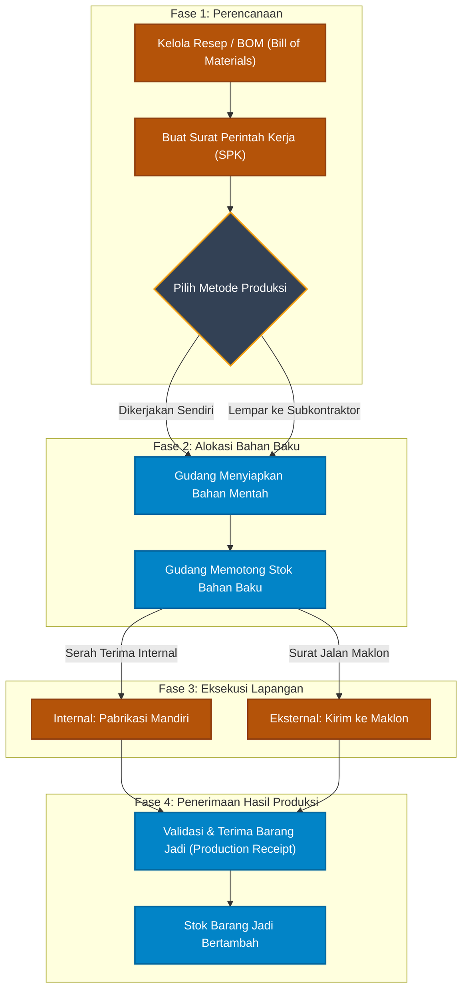

# 🏭 Alur Produksi & Perakitan (Manufacturing)

Dokumen ini memetakan standar operasional pembuatan barang jadi (Produksi) dari bahan mentah, serta hubungannya dengan Tim Gudang dan fitur *Maklon* (subkontrak) yang ada di sistem aplikasi Anda.

## Diagram Alur Produksi

---

## Penjelasan Fase

### Fase 1: Perencanaan
1. **Kelola Resep (BOM)**: Sebelum produksi dimulai, Kepala Produksi harus mendaftarkan Resep (*Bill of Materials*) ke sistem. Resep ini berisi daftar bahan mentah apa saja yang dibutuhkan untuk membuat 1 unit barang jadi.
2. **SPK & Metode**: Jika ada pesanan masuk atau stok habis, dibuatlah SPK (*Work Order*). Di sini, Kepala Produksi memutuskan apakah barang dirakit sendiri (Internal) atau diserahkan ke vendor pihak ketiga (Maklon).

### Fase 2: Alokasi Bahan Baku
3. **Persiapan & Pemotongan Stok**: Berdasarkan Resep pada SPK, sistem akan mengirimkan permintaan ke layar Gudang. Staf Gudang wajib menyiapkan fisik bahan mentah (contoh: kayu, paku, lem) dan mengklik konfirmasi. **Stok bahan mentah akan langsung berkurang di sistem.**

### Fase 3: Eksekusi
4. **Internal vs Maklon**: Bahan mentah yang sudah dikeluarkan Gudang tersebut kemudian dieksekusi. Jika internal, dirakit di ruang pabrikasi perusahaan. Jika Maklon, dikirimkan menggunakan truk ke pabrik vendor Maklon.

### Fase 4: Penerimaan Hasil Produksi (Production Receipt)
5. **Terima Barang Jadi**: Ini adalah fitur kunci di sistem Anda. Setelah proses produksi/maklon selesai, barang jadi yang sudah berwujud tidak otomatis masuk sistem. Kepala Gudang wajib masuk ke menu **Production Receipts** untuk memvalidasi kualitas (QC) dan kuantitas barang jadi yang diserahkan oleh tim pabrik/maklon.
6. **Selesai**: Setelah tombol simpan ditekan, barulah **stok barang jadi resmi bertambah** di gudang dan siap dijual ke pelanggan.
