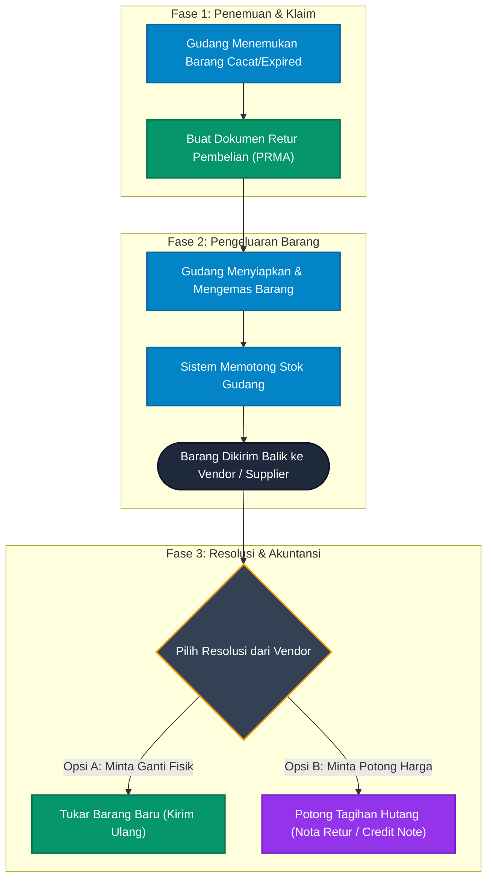

# 📤 Alur Retur Pembelian (Purchase Returns)

Dokumen ini menjelaskan Standar Operasional Prosedur (SOP) saat perusahaan menemukan bahan baku/barang yang cacat dari *Vendor/Supplier*, dan harus mengembalikan barang tersebut kepada mereka.

Siklus ini merupakan kebalikan dari proses Penerimaan Barang (Inbound) dan melibatkan pembatalan komitmen Hutang (Accounts Payable).

## Diagram Alur Retur ke Vendor

---

## Penjelasan Fase

### Fase 1: Penemuan Masalah
1. **Identifikasi**: Staf Gudang menemukan barang rusak, entah itu saat barang baru saja tiba, atau saat sedang melakukan *Stock Opname* di dalam rak.
2. **Klaim Retur**: Tim *Purchasing* membuat dokumen Retur Pembelian resmi di sistem yang dikirimkan ke pihak Vendor sebagai bukti komplain.

### Fase 2: Pengeluaran Fisik
3. **Pengurangan Stok**: Kepala Gudang memproses dokumen retur tersebut. Saat barang dinaikkan ke truk untuk dikirim balik, sistem secara otomatis akan **memotong persediaan stok barang** di gudang.
4. **Surat Jalan Retur**: Gudang membekali supir dengan Surat Jalan Keluar (Retur) untuk ditandatangani oleh Vendor penerima.

### Fase 3: Resolusi
Setelah barang sampai di tangan vendor, perusahaan berhak menuntut salah satu dari dua kompensasi:
5. **Tukar Barang Baru**: Jika perusahaan meminta ganti fisik, Vendor akan mengirimkan barang pengganti. Prosesnya akan mengulang *Alur Penerimaan Barang Inbound* dari awal.
6. **Potong Tagihan (Credit Note)**: Jika perusahaan tidak mau barang pengganti, maka Tim **Finance** akan menerima bukti Nota Retur (*Credit Note*). Saat jatuh tempo tagihan tiba, Finance akan membayar tagihan vendor **dikurangi nilai barang cacat** yang dikembalikan, sehingga arus kas perusahaan tetap terlindungi.
