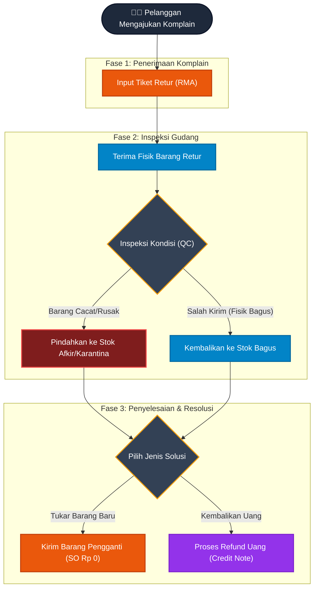

# 🔙 Alur Retur & Komplain (Reverse Logistics)

Dokumen ini menjelaskan Standar Operasional Prosedur (SOP) ketika pelanggan mengembalikan barang (Retur) akibat cacat produksi, kesalahan pengiriman, atau alasan lainnya. 

Proses ini sangat penting untuk memastikan bahwa barang rusak tidak tercampur dengan stok bagus, dan pelanggan mendapatkan kompensasi yang tepat.

## Diagram Alur Retur

---

## Penjelasan Fase

### Fase 1: Penerimaan Komplain
1. **Komplain Masuk**: Pelanggan menghubungi perusahaan (melalui Tim Sales atau Customer Service) untuk mengeluhkan barang yang bermasalah.
2. **Input Tiket Retur**: Tim Sales memasukkan dokumen retur ke dalam sistem agar tercatat secara resmi. Dokumen ini menjadi sinyal bagi tim Gudang bahwa akan ada paket retur yang datang dari pelanggan.

### Fase 2: Penerimaan & Inspeksi Gudang
3. **Terima Fisik**: Ketika kurir membawa paket retur kembali ke gudang, Kepala Gudang mencatat penerimaan barang tersebut di sistem.
4. **Inspeksi (QC)**: Gudang melakukan pengecekan kualitas terhadap barang yang dikembalikan:
   * **Stok Afkir / Karantina**: Jika barang memang rusak, cacat produksi, atau pecah, barang tersebut akan dimasukkan ke "Gudang Karantina". Barang di karantina tidak akan pernah bisa ditarik oleh sistem untuk dikirimkan ke pelanggan lain (mencegah kesalahan berulang).
   * **Stok Bagus**: Jika alasan retur hanyalah karena pelanggan salah pesan atau Gudang salah kirim varian (namun fisik barang masih tersegel dan bagus), maka barang dikembalikan ke rak "Stok Bagus" agar bisa dijual kembali.

### Fase 3: Penyelesaian (Resolusi)
Setelah inspeksi fisik selesai, sistem mengharuskan perusahaan untuk memberikan kompensasi kepada pelanggan sesuai kesepakatan:
5. **Kirim Barang Pengganti**: Jika pelanggan ingin menukar dengan barang baru, Tim Sales membuat *Sales Order* khusus penggantian dengan nilai tagihan Rp 0. Pesanan ini akan masuk ke Kanban Gudang untuk diproses (dikemas dan dikirim) seperti pesanan biasa.
6. **Refund Uang**: Jika pelanggan meminta uangnya kembali, sistem akan mengirimkan instruksi otomatis kepada Tim **Finance** untuk mencetak *Credit Note* dan melakukan transfer dana (Refund) kepada pelanggan.
