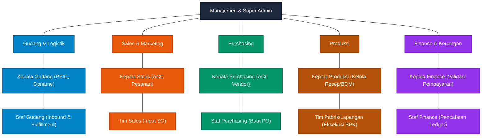
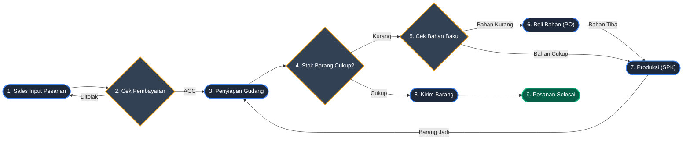

# 🏢 Struktur Organisasi & Alur Kerja

Berdasarkan sistem dan alur kerja aplikasi, berikut adalah pemisahan antara **Struktur Organisasi** (pembagian peran) dan **Alur Kerja Operasional** (bagaimana mereka berinteraksi).

## 1. Bagan Struktur Organisasi

Ini adalah garis komando murni untuk menunjukkan siapa melapor kepada siapa tanpa adanya alur kerja yang menyilang.

---

## 2. Alur Kerja (Order to Cash)

Berikut adalah urutan proses (*Sequence Diagram*) dari saat Sales mendapatkan pesanan, proses pemenuhan barang oleh Gudang, hingga pelunasan tagihan oleh Finance.

## Deskripsi Singkat

1. **Gudang & Logistik (Jantung Fisik)**
   Bertugas menerima barang masuk (Inbound) dari vendor, menyiapkan barang keluar (Fulfillment) untuk pelanggan Sales, dan memastikan fisik stok akurat (Stock Opname). Di lapangan, Staf Gudang mengomando tim angkat/packing tanpa mengharuskan kuli/pekerja lapangan memegang aplikasi.
   
2. **Sales & Marketing (Garda Depan)**
   Mencari pelanggan dan memasukkan pesanan pesanan (Sales Order) ke sistem. Pesanan ini akan terlihat di Kanban Gudang setelah mendapat konfirmasi pembayaran dari tim Finance.

3. **Purchasing (Pengadaan)**
   Memastikan gudang tidak pernah kehabisan barang dagangan maupun bahan baku produksi dengan cara merespons peringatan dari Kepala Gudang dan melakukan pemesanan (Purchase Order) ke vendor eksternal.

4. **Produksi (Perakitan)**
   Jika perusahaan memiliki sistem rakit (manufaktur), divisi ini meminta bahan baku dari Kepala Gudang (PPIC), memproses SPK, dan meretur barang jadi kembali ke Gudang untuk dijual oleh tim Sales.

5. **Finance (Arus Kas)**
   Memvalidasi bahwa pesanan yang dibuat tim Sales benar-benar sudah dibayar (mencegah *fraud*), melunasi tagihan vendor dari tim Purchasing, serta menjaga kesehatan keuangan secara umum.
